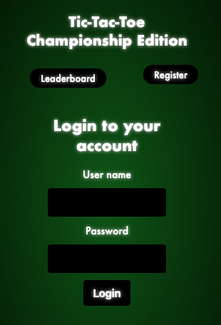
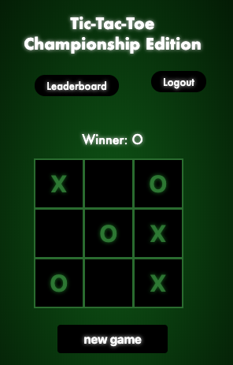
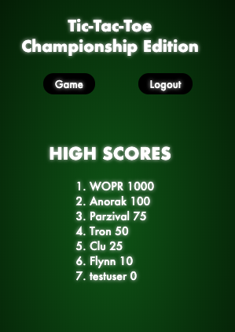

# Tic-Tac-Toe Championship Edition
## Live App link
* https://tic-tac-toe-three.now.sh/

* client deployed on zeit
* server deployed on Heroku

## App Images

### Summary
A Tic-Tac-Toe game where a user, creates a username and plays a game. The game displays the winner of the game. The game will display the top 10 usernames and highscores. 

#### Technology Stack
### Front End
  * HTML5
  * CSS 
  * JavaScript
  * React
  * enzyme 
  * Redux

### Back End
  * Node.js
  * Express
  * Mocha
  * Chai
  * PostgreSQL
  * bcryptjs
  * Passport
  * JWT Authentication

### Development Environment
  * Git
  * GitHub 
  * Postman
  * DBeaver
  * Visual Studio Code
  * GitHub Projects

#### API Documentation
API endpoints
* POST to '/api/users' posts new user info into database 
* POST to '/api/users/game' updates a new game 
* POST to '/api/auth/login' authenticate and login returning user 
* GET to '/api/users/leaderboard' gets leaderboard results and sorts by order of wins 
