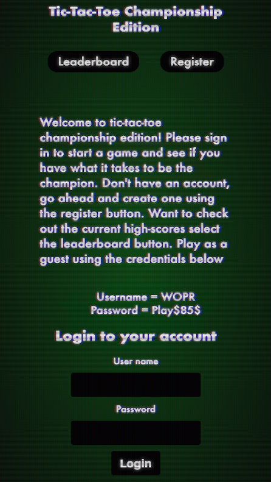
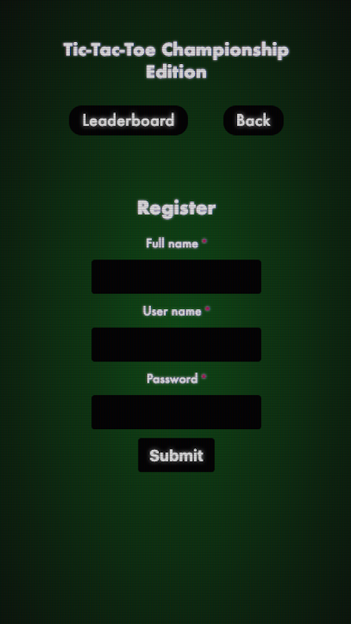
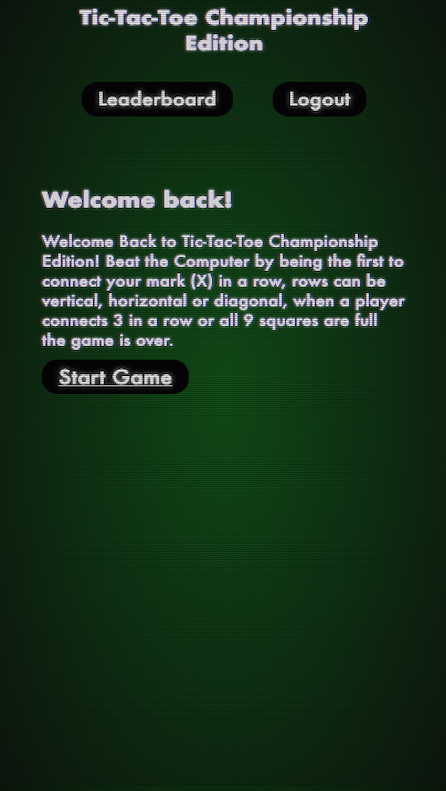
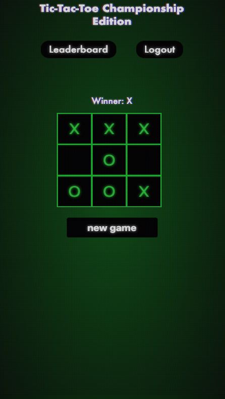
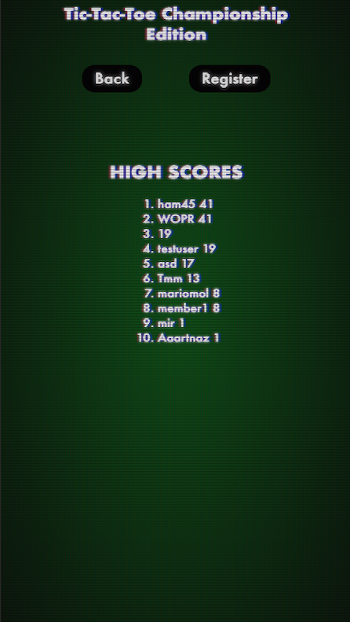

# Tic-Tac-Toe Championship Edition

> A full stack application/game of tic-tac-toe.

[![Build Status][travis-image]][travis-url]
[![NPM Version][npm-image]][npm-url]

## Live App link

- https://tic-tac-toe-three.now.sh/

- Client deployed on zeit
- Server deployed on Heroku

## App Images

  
  
  
  
  

## Summary

Tic-Tac-Toe Championship Edition is a full stack application where users compete against the computer. Users can create an account by registering or playing using the provided testing credentials on the home page. Users' wins are posted using the backend API, the leaderboard displays the top 10 players and their scores.

## Technology Stack

### Front End

- HTML5
- CSS
- JavaScript
- React
- Enzyme
- Redux

### Back End

- Node.js
- Express
- Mocha
- Chai
- PostgreSQL
- Bcryptjs
- Passport
- JWT Authentication

### Development Environment

- Git
- GitHub
- Postman
- DBeaver
- Visual Studio Code
- GitHub Projects

## API Documentation

### API endpoints

- POST to '/api/users' posts new user info into database
- POST to '/api/users/game' updates a new game
- POST to '/api/auth/login' authenticate and login returning user
- GET to '/api/users/leaderboard' gets leaderboard results and sorts by order of wins

<!-- Markdown link & img dfn's -->

[npm-image]: https://img.shields.io/npm/v/datadog-metrics.svg?style=flat-square
[npm-url]: https://npmjs.org/package/datadog-metrics
[travis-image]: https://img.shields.io/travis/dbader/node-datadog-metrics/master.svg?style=flat-square
[travis-url]: https://travis-ci.org/dbader/node-datadog-metrics

---

## Contributors

This application was built by [Humberto Hernandez](https://github.com/WiFiCowboy)
